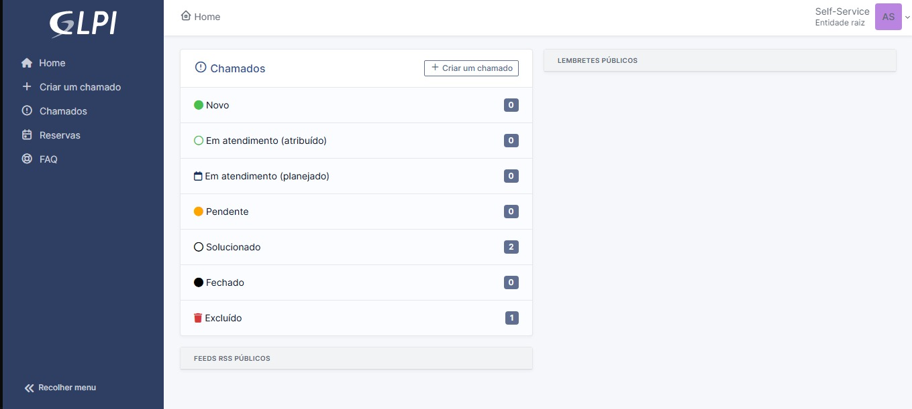
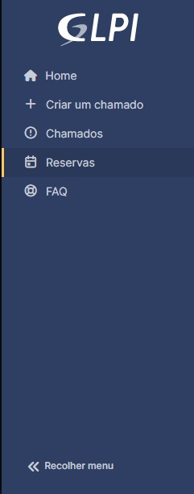
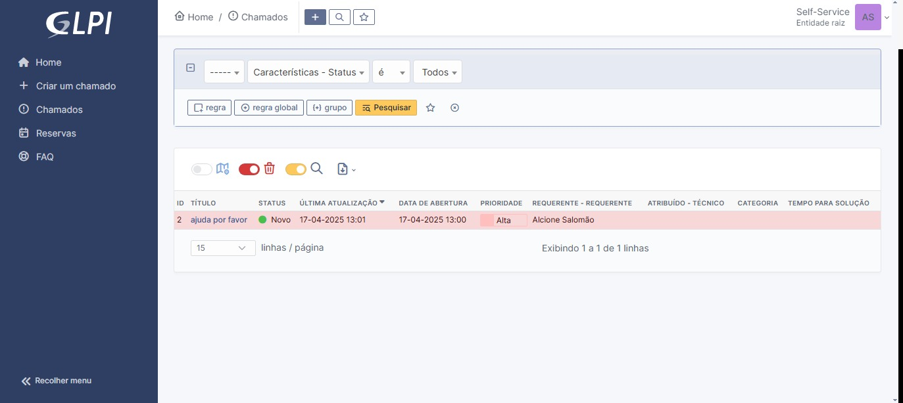
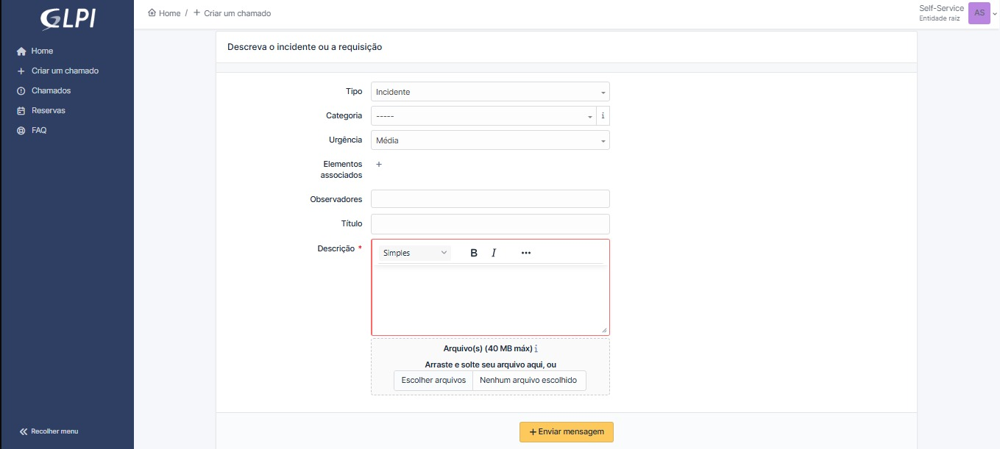

# Guia Rápido da Interface GLPI

___

Este documento descreve as principais funcionalidades visíveis na tela de gerenciamento de chamados do GLPI.

## 1. Menu Lateral Esquerdo

___

Esta barra vertical à esquerda contém as principais opções de navegação:

* **Home:** Leva para a página inicial do sistema.
* **Criar um chamado:** Inicia o processo para abrir um novo ticket de suporte ou solicitação.
* **Chamados:** Exibe a lista de chamados existentes (tela atual na imagem).
* **Reservas:** (Se habilitado) Permite gerenciar reservas de itens ou recursos.
* **FAQ:** Acesso à Base de Conhecimento ou Perguntas Frequentes.
* **Recolher menu:** Minimiza ou expande este menu lateral.

## 2. Dentro da Aba de Chamados

___

### 2.1 Barra de Filtros e Pesquisa
Permite refinar a lista de chamados exibida.
* **Filtros Predefinidos:** Botões para filtrar por `Características`, `Status` e outros critérios (`Todos`).
* **Campo de Pesquisa:** Caixa para busca textual, com opções para `Limpar` a busca, aplicar `regra global` ou filtrar por `grupo` antes de clicar em `Pesquisar`.
* **Ações de Visualização:** Ícones para salvar a pesquisa atual ou configurar a visualização.

### 2.2 Tabela de Chamados
* `ID`: Exibe a numeração do chamado
* `Título`: Assunto do chamado.
* `Status`: Situação atual do chamado (Ex: Novo, Em atendimento, Pendente, Solucionado, Fechado).
* `Última Atualização`: Data e hora da última modificação.
* `Data de Abertura`: Quando o chamado foi criado.
* `Prioridade`: Nível de urgência (Ex: Baixa, Média, Alta, Urgente).
* `Requerente`: Usuário que abriu o chamado.
* `Atribuído - Técnico`: Técnico ou grupo responsável pelo atendimento.
* `Categoria`: Classificação do chamado.
* `Tempo para Solução`: Prazo estimado ou meta para resolução (SLA).
* `Seleção`: Permite selecionar chamados individualmente ou todos de uma vez para ações em massa.

### 2.3 Controles de Paginação
Localizados abaixo da tabela.
* **Linhas por Página:** Dropdown para selecionar quantos chamados serão exibidos por página (Ex: 15, 30, 50).
* **Navegação:** Informa o total de chamados encontrados e permite navegar entre as páginas de resultados.

## 3. Dentro da Aba de Criar Chamados 

___

Esta tela permite ao usuário registrar um novo chamado, seja um incidente ou uma requisição. A interface é simples e direta, garantindo que todas as informações necessárias sejam preenchidas corretamente.

| Campo                  | Descrição                                                                 |
|------------------------|---------------------------------------------------------------------------|
| **Tipo**               | Define o tipo do chamado: `Incidente` ou `Requisição`.                    |
| **Categoria**          | Classificação do chamado de acordo com as categorias definidas.           |
| **Urgência**           | Nível de urgência do chamado (`Baixa`, `Média`, `Alta`).                  |
| **Elementos Associados** | Permite associar itens ou ativos relacionados ao chamado.               |
| **Observadores**       | Campo para adicionar usuários que devem acompanhar o chamado.             |
| **Título**             | Assunto resumido do chamado.                                              |
| **Descrição**          | Campo obrigatório para detalhar o problema ou a solicitação.              |
| **Arquivos**           | Área para anexar arquivos (limite de 40 MB). Pode arrastar ou escolher.   |

* `Editor de Texto da Descrição`: Possui opções básicas de formatação como **negrito**, *itálico*, e mais.
* `Botão "Enviar mensagem`: Envia o chamado com as informações preenchidas.

### 3.1 Observações

- Os campos obrigatórios são marcados com `*`.
- O campo **Descrição** é indispensável para enviar o chamado.
- O botão **Escolher arquivos** permite o upload de documentos de apoio como prints, logs ou relatórios.
___

## 4 FAQ - Perguntas frequentes

---
Essa tela permite vizualizar a aba de perguntas frequentes, sendo possível ver todas especificadamente, ou até mesmo pesquisar por uma em específico.

## 5 Reservas - Futura Funcionalidade
